# Blogy — Complete Project Overview

> **AI Content Intelligence Engine** that converts a single keyword into a fully optimized, ranking-ready blog post through a 6-stage AI reasoning pipeline with multi-provider LLM fallback.

---

## 1. What is Blogy?

Blogy is a **full-stack AI-powered content generation platform** that takes a single keyword as input and produces:

- A **2000+ word**, SEO-optimized, human-sounding blog post
- **SEO scoring** with detailed breakdown (keyword placement, density, heading structure, meta quality)
- **Readability analysis** (Flesch Reading Ease score, sentence complexity)
- **Naturalness scoring** to detect and avoid AI-sounding clichés
- **Snippet readiness** assessment for Google Featured Snippets and AI answer engines
- **Internal linking suggestions** with contextual anchor text
- **Content strategy justification** explaining *why* the content can rank

All of this happens in a single click, with **real-time progress streaming** via SSE to the browser.

---

## 2. Tech Stack

| Layer | Technology | Purpose |
|-------|-----------|---------|
| **Backend Framework** | FastAPI (Python) | REST API + SSE streaming |
| **LLM Providers** | Ollama, Gemini, Groq, OpenAI, Grok (xAI) | AI text generation |
| **HTTP Client** | httpx | Provider API calls |
| **OpenAI SDK** | openai (Python) | OpenAI-compatible providers (Groq, OpenAI, Grok) |
| **Config** | python-dotenv + Pydantic | Environment-based configuration |
| **Frontend** | Vanilla HTML + CSS + JavaScript | Single-page application |
| **Markdown Rendering** | marked.js (CDN) | Blog preview in browser |
| **Font** | Inter + JetBrains Mono (Google Fonts) | Typography |
| **Server** | Uvicorn (ASGI) | Serves both API and static frontend |

### Dependencies ([requirements.txt](file:///c:/Users/DELL/OneDrive/Desktop/Blogy/requirements.txt))
```
fastapi==0.115.0
uvicorn==0.30.6
openai==1.51.0
python-dotenv==1.0.1
pydantic==2.9.2
httpx==0.27.2
sse-starlette==2.1.3
```

---

## 3. Project Architecture

### Directory Structure

```
Blogy/
├── main.py                      # FastAPI entry point (API routes + SSE)
├── config.py                    # Centralized settings (API keys, thresholds, temperatures)
├── requirements.txt             # Python dependencies
├── test_pipeline.py             # End-to-end pipeline test script
├── .env                         # API keys (not committed to git)
├── .gitignore                   # Git exclusions
│
├── pipeline/                    # 🧠 AI Content Generation Pipeline
│   ├── __init__.py
│   ├── orchestrator.py          #   Pipeline sequencer (6 stages)
│   ├── prompt_flow.py           #   All LLM prompt templates (4 prompt sets)
│   ├── keyword_intelligence.py  #   Stage 1: Keyword research via AI
│   ├── serp_analyzer.py         #   Stage 2: SERP reverse engineering
│   ├── content_strategy.py      #   Stage 3: Content blueprint generation
│   ├── blog_generator.py        #   Stage 4: Section-by-section blog writing
│   ├── seo_analyzer.py          #   Stage 5: Pure-Python SEO validation (756 lines)
│   ├── internal_linker.py       #   Stage 6: Internal link suggestions
│   └── json_parser.py           #   Robust LLM JSON parser (7 repair strategies)
│
├── providers/                   # 🔌 Multi-Provider LLM Layer
│   ├── __init__.py
│   ├── base.py                  #   Abstract BaseProvider interface
│   ├── manager.py               #   Round-robin manager + health tracking (342 lines)
│   ├── gemini_provider.py       #   Google Gemini (REST API via httpx)
│   ├── groq_provider.py         #   Groq (OpenAI-compatible SDK)
│   ├── openai_provider.py       #   OpenAI (native SDK)
│   ├── grok_provider.py         #   xAI Grok (OpenAI-compatible SDK)
│   └── ollama_provider.py       #   Ollama local (OpenAI-compatible via httpx)
│
└── static/                      # 🎨 Frontend (SPA)
    ├── index.html               #   Main HTML (284 lines)
    ├── styles.css               #   Full CSS with dark theme + glassmorphism (34K)
    ├── app.js                   #   Frontend logic, SSE, rendering (817 lines)
    └── favicon.svg              #   SVG favicon
```

### High-Level Architecture Diagram

```mermaid
graph TD
    A["👤 User<br/>Enters Keyword"] --> B["🌐 Frontend SPA<br/>(HTML + JS + CSS)"]
    B -->|POST /api/generate/stream| C["⚡ FastAPI Server<br/>(main.py)"]
    C --> D["🎯 Pipeline Orchestrator<br/>(orchestrator.py)"]
    
    D --> E1["Stage 1: Keyword Intelligence"]
    E1 --> E2["Stage 2: SERP Analysis"]
    E2 --> E3["Stage 3: Content Strategy"]
    E3 --> E4["Stage 4: Blog Generation"]
    E4 --> E5["Stage 5: SEO Validation"]
    E5 --> E6["Stage 6: Internal Linking"]
    
    E1 & E2 & E3 & E4 & E6 -->|LLM calls| F["🔌 Provider Manager<br/>(Round-Robin + Fallback)"]
    
    F --> G1["🦙 Ollama<br/>(Local, Free)"]
    F --> G2["💎 Gemini<br/>(Free Tier)"]
    F --> G3["⚡ Groq<br/>(Free Tier)"]
    F --> G4["🤖 OpenAI<br/>(Paid)"]
    F --> G5["🌟 Grok<br/>(Paid)"]
    
    E5 -->|No LLM| H["📊 Pure Python<br/>SEO Engine"]
    
    D -->|SSE Events| C
    C -->|Server-Sent Events| B
    B --> I["📄 Rendered Blog<br/>+ SEO Dashboard"]

    style E5 fill:#1a1a2e,stroke:#34d399
    style H fill:#1a1a2e,stroke:#34d399
```



---

## 4. The 6-Stage Pipeline (Core Engine)

The heart of Blogy is a **sequential 6-stage pipeline** defined in [orchestrator.py](file:///c:/Users/DELL/OneDrive/Desktop/Blogy/pipeline/orchestrator.py). Each stage builds on the output of previous stages, creating a chain of context accumulation.

### Pipeline Flow

```mermaid
flowchart LR
    K["🔑 Keyword"] --> S1
    S1["1️⃣ Keyword<br/>Intelligence"] -->|semantic clusters<br/>intent<br/>feasibility| S2
    S2["2️⃣ SERP<br/>Analysis"] -->|heading patterns<br/>content gaps| S3
    S3["3️⃣ Content<br/>Strategy"] -->|outline<br/>title<br/>meta desc| S4
    S4["4️⃣ Blog<br/>Generation"] -->|full markdown<br/>sections| S5
    S5["5️⃣ SEO<br/>Validation"] -->|scores<br/>readability<br/>naturalness| S6
    S6["6️⃣ Internal<br/>Linking"] -->|link suggestions| R["📦 Final<br/>Result"]

    style S5 fill:#0d1117,stroke:#34d399,stroke-width:2px
```



---

### Stage 1: Keyword Intelligence ([keyword_intelligence.py](file:///c:/Users/DELL/OneDrive/Desktop/Blogy/pipeline/keyword_intelligence.py))

**Purpose:** Analyze the input keyword to understand search intent, discover related terms, and assess ranking feasibility.

**LLM Call:** Yes (temperature: 0.3 — precision-focused)

**Output:**
| Field | Description |
|-------|-------------|
| `primary_keyword` | The exact input keyword |
| `semantic_clusters` | Grouped keywords: `core_topic`, `related_concepts`, `use_cases` |
| `long_tail_variations` | 5-8 specific long-tail search queries |
| `lsi_keywords` | 8-12 latent semantic indexing keywords  |
| `question_queries` | 6-8 question-based search queries |
| `intent_classification` | `informational`, `commercial`, or `transactional` |
| `intent_reasoning` | 2-3 sentence explanation of intent classification |
| `ranking_feasibility` | Array of keywords with competition level, relevance, and score (0-1) |

---

### Stage 2: SERP Reverse Engineering ([serp_analyzer.py](file:///c:/Users/DELL/OneDrive/Desktop/Blogy/pipeline/serp_analyzer.py))

**Purpose:** Infer how top-ranking pages are structured for this keyword cluster — without scraping actual SERPs.

**LLM Call:** Yes (temperature: 0.4)

**Output:**
| Field | Description |
|-------|-------------|
| `typical_heading_structure` | H1/H2/H3 patterns with examples |
| `content_depth_patterns` | Word count range, section count, format mix |
| `keyword_positioning` | How keywords appear in title, intro, headings, conclusion |
| `content_gaps` | 5-7 gaps with severity (high/medium/low), gap_type, and exploitation strategy |
| `gap_report_summary` | 3-5 sentence executive summary |

> [!IMPORTANT]
> This stage does NOT scrape real SERPs. It uses AI reasoning to infer typical patterns — avoiding legal/ethical scraping issues while still producing actionable insights.

---

### Stage 3: Content Strategy ([content_strategy.py](file:///c:/Users/DELL/OneDrive/Desktop/Blogy/pipeline/content_strategy.py))

**Purpose:** Build the complete content blueprint — title, meta description, section outline, keyword mapping, tone strategy, and GEO optimization.

**LLM Call:** Yes (temperature: 0.5)

**Output:**
| Field | Description |
|-------|-------------|
| `seo_title` | CTR-optimized title (50-60 chars) |
| `meta_description` | Compelling meta description (150-160 chars) |
| `outline` | 8-12 sections with heading, level, target keywords, section notes, GEO format |
| `section_keyword_map` | Maps each section heading to its target keywords |
| `tone_strategy` | Voice, positioning, differentiation, conversion hooks |
| `geo_optimization` | Blocks for AI answer engine extraction: definitions, numbered processes, tables, Q&A, takeaway boxes |

**GEO Format Types per section:**
- `paragraph` — Standard prose
- `definition` — Clear, extractable definitions
- `list` — Bullet/numbered lists
- `table` — Markdown tables
- `qa` — Question and answer format
- `process` — Numbered steps

---

### Stage 4: Blog Generation ([blog_generator.py](file:///c:/Users/DELL/OneDrive/Desktop/Blogy/pipeline/blog_generator.py))

**Purpose:** Generate the full blog post section-by-section with intelligent batching and keyword density control.

**LLM Call:** Yes, multiple calls (temperature: 0.7 — creative)

**Key Design Decisions:**

#### Section Batching
Instead of one API call per section (10+ calls for a long blog), Blogy **batches middle sections** in groups of 2:
- **Introduction** → solo call (quality matters most)
- **Middle sections** → batched in pairs (2 sections per API call)
- **Conclusion** → solo call (quality matters)

**Result:** A 10-section blog uses ~5-6 API calls instead of 10.

#### Dynamic Keyword Density Control
Each section gets a **dynamic density instruction** based on how many times the keyword has been used so far:

| Keyword Count | Instruction |
|--------------|-------------|
| 0 (intro) | "MUST use keyword ONCE in first 2-3 sentences" |
| ≤ 2 | "Usage is still low. Use keyword ONCE" |
| ≤ 5 | "Usage is moderate. Use keyword ONCE, also mix in synonyms" |
| ≤ 8 | "Healthy. Use ZERO or ONE time. Prefer synonyms" |
| > 8 | "Approaching limit. Do NOT use keyword. Use synonyms only" |

**Target:** 1-2% density for a ~2000-word blog = 7-13 total mentions of a 3-word keyword.

#### Writing Style Enforcement
The system prompt enforces:
- 8th-grade reading level
- Short sentences (8-20 words)
- Active voice
- Contractions
- Direct reader address ("you", "your")
- **30+ forbidden phrases** (AI clichés like "In today's...", "leverage", "game-changer", etc.)

#### Batch Response Splitting
When multiple sections are generated in one call, the response is split using:
1. Heading markers (`##`, `###`)
2. If parts don't match, extra parts are merged into the last section
3. If too few parts, fallback to word-count-based splitting

**Output:**
| Field | Description |
|-------|-------------|
| `full_markdown` | Complete blog as a single markdown string |
| `sections` | Array of sections with heading, level, content, word_count, keyword_hits |
| `total_word_count` | Total words across all sections |
| `total_keyword_mentions` | How many times the primary keyword appears |
| `api_calls_used` | Number of LLM API calls consumed |

---

### Stage 5: SEO + Quality Validation ([seo_analyzer.py](file:///c:/Users/DELL/OneDrive/Desktop/Blogy/pipeline/seo_analyzer.py))

> [!TIP]
> **This is the largest module (756 lines) and uses NO LLM calls.** All analysis is done with pure Python algorithms — making it fast, deterministic, and free.

**Purpose:** Comprehensive quality validation covering SEO, readability, naturalness, and snippet readiness.

#### 5a. SEO Score (0-100 points)

Broken into 4 categories:

| Category | Max Points | What it Checks |
|----------|-----------|-----------------|
| **Keyword Placement** | 30 | Title (8), meta description (5), introduction (7), headings (7), conclusion (3) |
| **Keyword Density** | 25 | Exact density 1-2.5%=25pts, 0.5-1% or 2.5-3.5%=15pts, >3.5%=5pts |
| **Heading Structure** | 25 | Single H1 (8), 4+ H2s (10), 2+ H3s (7) |
| **Meta Quality** | 20 | Title length 50-60 chars (10), meta desc 140-160 chars (10) |

**Multi-word keyword support:** For multi-word keywords like "content marketing strategy", the system checks for both **exact phrase matches** and **partial matches** (all individual words present nearby). Partial matches earn reduced but still meaningful points.

#### 5b. Readability Analysis

- **Flesch Reading Ease** score (0-100)
  - Improved syllable counter with suffix handling (`-ment`, `-ness`, `-ful`, `-less`, `-ly`)
  - 10% syllable reduction calibration for more accurate scores
- **Grade levels:** Very Easy (80+), Easy (70+), Fairly Easy (60+), Standard (50+), Fairly Difficult (40+), Difficult (30+), Very Difficult
- Average sentence length, total words, total sentences, complexity rating

#### 5c. Naturalness Analysis (Multi-Signal Engine)

The naturalness score combines **penalty signals** (40% weight) and **positive writing quality signals** (60% weight):

**Penalty Signals:**
| Signal | Detection | Max Penalty |
|--------|-----------|-------------|
| Multi-word AI clichés | 28 phrases (e.g., "in today's", "deep dive", "navigate the complexities") | 20 pts |
| Single-word AI clichés | 15 words (e.g., "leverage", "robust", "landscape") — only if used 2+ times | 8 pts |
| Repetitive trigrams | Trigrams appearing 4+ times | 12 pts |
| Overused transitions | "furthermore", "moreover", etc. appearing 3+ times | 10 pts |

**Positive Signals (Weighted Average):**
| Signal | Weight | What it Measures |
|--------|--------|-----------------|
| Sentence Length Variance | 25% | Coefficient of variation of sentence lengths (CV ≥0.5 = 100, <0.15 = 30) |
| Vocabulary Diversity | 25% | Moving Average Type-Token Ratio (MATTR with 100-word windows) |
| Sentence Opener Variety | 20% | How often sentences start with the same word (>15% = penalty) |
| Passive Voice Ratio | 15% | Heuristic passive detection (≤15% passive = 100, >50% = 20) |
| Paragraph Length Quality | 15% | Flags paragraphs >80 words (long) or >120 words (very long) |

**Final Formula:** `score = cliche_base × 0.40 + positive_score × 0.60`

#### 5d. Snippet Readiness

Checks 5 elements for **Google Featured Snippet** and AI answer engine compatibility:
1. ✅ Clear definitions (`is defined as`, `refers to`, `is a`)
2. ✅ Bullet/numbered lists
3. ✅ Comparison tables
4. ✅ Q&A / FAQ sections
5. ✅ Structured headings (H1/H2/H3)

Score = (elements present / 5) × 100%

#### 5e. Keyword Density Report

- Primary keyword density with warnings if < 0.5% or > 3.5%
- Top 10 LSI keyword densities
- Per-keyword warnings for over-optimization

---

### Stage 6: Internal Linking ([internal_linker.py](file:///c:/Users/DELL/OneDrive/Desktop/Blogy/pipeline/internal_linker.py))

**Purpose:** Suggest natural internal links from the blog content to predefined site pages.

**LLM Call:** Yes (temperature: 0.3 — precision)

**Internal Pages (configured in [config.py](file:///c:/Users/DELL/OneDrive/Desktop/Blogy/config.py)):**
- `/pricing` — Pricing Plans
- `/features` — Platform Features
- `/case-studies` — Case Studies
- `/blog` — Blog
- `/docs` — Documentation

**Output:** 3-6 link suggestions with:
- `anchor_text` — Exact text from the blog to hyperlink
- `url` — Target internal page
- `section` — Which blog section it appears in
- `reasoning` — Contextual justification
- `placement_type` — `natural_mention`, `call_to_action`, or `reference`

---

## 5. Multi-Provider LLM System

### Provider Abstraction ([base.py](file:///c:/Users/DELL/OneDrive/Desktop/Blogy/providers/base.py))

All providers implement a unified `BaseProvider` abstract class:
```python
class BaseProvider(ABC):
    name: str = "base"
    is_free_tier: bool = False
    
    def chat_completion(messages, temperature, max_tokens) -> str  # Abstract
    def is_configured() -> bool  # Abstract
```

### Supported Providers

| Provider | Model | Free Tier | Rate Limit | API Style |
|----------|-------|-----------|------------|-----------|
| **Ollama** (local) | llama3.1:8b | ✅ Unlimited | ∞ (local) | OpenAI-compatible REST |
| **Gemini** | gemini-2.0-flash | ✅ 15 RPM | 15 RPM | REST (httpx) |
| **Groq** | llama-3.3-70b-versatile | ✅ 30 RPM | 30 RPM | OpenAI SDK |
| **OpenAI** | gpt-4o-mini | ❌ Paid | 60 RPM | OpenAI SDK |
| **Grok (xAI)** | grok-3 | ❌ Paid | 60 RPM | OpenAI SDK |

### Provider Manager ([manager.py](file:///c:/Users/DELL/OneDrive/Desktop/Blogy/providers/manager.py))

The `ProviderManager` is a **singleton** that handles all LLM routing with these scalability features:

#### Round-Robin Rotation
Instead of always hitting the first provider (which would exhaust its rate limit), the manager **rotates through all providers** using a counter. Each call starts with the next provider in sequence.

#### Automatic Fallback Chain
If a provider fails, it falls to the next available one. The order is determined by:
1. Round-robin index (which provider is "next")
2. Availability check (healthy AND not rate-limited)

#### Rate Limit Protection
- **Per-provider throttling:** Each call waits `(60 / RPM) × 1.2` seconds since the last request to that provider
- **Rate limit detection:** If a 429 or "rate limit" error occurs, the provider enters a **45-second cooldown**
- **Auto-recovery:** After cooldown expires, the provider automatically rejoins the rotation

#### Health Tracking (`ProviderHealth` class)
Per-provider metrics:
- Total requests, failures, failure rate
- Average response time
- Consecutive failure count
- Rate limit cooldown timestamp
- **Unhealthy if:** 5+ consecutive failures in the last 60 seconds

#### Retry with Exponential Backoff
- `max_retries`: 2 (configurable via `PROVIDER_MAX_RETRIES` env var)
- `backoff_base`: 1.0s (configurable via `PROVIDER_BACKOFF_BASE`)
- Backoff formula: `base × 2^(attempt-1)`

#### Smart Error Routing
| Error Type | Action |
|-----------|--------|
| 400 / Bad Request / Model not found | Skip to next provider (don't retry) |
| 429 / Rate limit | Set 45s cooldown, skip to next provider |
| Other errors | Exponential backoff + retry |

---

## 6. Prompt Engineering ([prompt_flow.py](file:///c:/Users/DELL/OneDrive/Desktop/Blogy/pipeline/prompt_flow.py))

All prompts are centralized in a single `PROMPTS` dictionary with 4 prompt sets:

| Key | Used By | System Role |
|-----|---------|-------------|
| `keyword_intelligence` | Stage 1 | SEO keyword research analyst |
| `serp_analysis` | Stage 2 | SERP analysis specialist |
| `content_strategy` | Stage 3 | Senior content strategist |
| `blog_section` | Stage 4 | Expert content writer |
| `internal_linking` | Stage 6 | Internal linking specialist |

### Prompt Design Principles
1. **Structured output:** Every prompt demands a specific JSON schema
2. **Anti-hallucination:** "Do NOT reference specific competitor URLs or brand names"
3. **Defensive defaults:** Each pipeline stage applies `setdefault()` for all expected keys
4. **Temperature ladder:** Precision stages use low temps (0.3-0.4), creative stages use higher (0.7)

### Robust JSON Parsing ([json_parser.py](file:///c:/Users/DELL/OneDrive/Desktop/Blogy/pipeline/json_parser.py))

LLMs frequently return malformed JSON. The parser tries **7 sequential repair strategies:**

1. Strip markdown code fences (` ```json ... ``` `)
2. Direct `json.loads()`
3. Remove trailing commas
4. Remove control characters + trailing commas
5. Extract JSON object (find first `{`, match to closing `}`)
6. Close unclosed brackets/braces
7. Replace single quotes with double quotes

---

## 7. Frontend Application

### Technology
- **Pure Vanilla HTML/CSS/JS** — no frameworks, no build step
- **Dark theme** with glassmorphism effects
- **Inter** font for UI, **JetBrains Mono** for code
- **Particle animation** background (Canvas 2D)
- Served directly by FastAPI (`StaticFiles`)

### Key UI Features

#### Real-Time SSE Pipeline Progress
The frontend uses `fetch()` with `ReadableStream` to consume Server-Sent Events. As each pipeline stage starts/completes, animated stages light up with timing info.

#### 6-Tab Output Dashboard
| Tab | Content |
|-----|---------|
| **Blog** | Rendered markdown with SERP preview (title, URL, meta description), word/section/read-time stats |
| **SEO Analysis** | Animated SVG ring scores (SEO, Readability, Naturalness, Snippet Ready), breakdown bars, keyword density table |
| **SERP Gaps** | Gap cards color-coded by severity (high/medium/low) with exploitation opportunities |
| **Links** | Internal link suggestions with anchor text, target URL, reasoning, placement type |
| **Snippets** | Snippet readiness score + checklist (definitions, lists, tables, Q&A, headings) |
| **Strategy** | Ranking reasons, competitive advantages, content outline with keyword mapping, pipeline timing breakdown |

#### Export Options
- **Copy as Markdown** — clipboard
- **Copy as HTML** — clipboard
- **Download .md** — file download with keyword-based filename

#### Generation History
- Stored in `localStorage` (last 20 generations)
- Slide-in drawer with keyword, SEO score, word count, timing
- Click any history item to pre-fill the keyword input

#### Provider Health Indicator
- Real-time dot indicator (green/yellow/red)
- Shows Ollama + cloud provider count
- Auto-shows **Ollama installation banner** if no local AI is configured

---

## 8. API Endpoints ([main.py](file:///c:/Users/DELL/OneDrive/Desktop/Blogy/main.py))

| Method | Endpoint | Description |
|--------|----------|-------------|
| `POST` | `/api/generate` | Full pipeline execution — returns complete JSON result |
| `POST` | `/api/generate/stream` | **SSE streaming** — yields `stage_start`, `stage_complete`, `done`, `error` events |
| `GET` | `/api/providers/health` | Health metrics for all providers (failure rate, response time, rate limits) |
| `GET` | `/api/providers/active` | List of active (configured + healthy) provider names |
| `GET` | `/api/history` | In-memory generation history |
| `GET` | `/` | Serves the static frontend SPA |

### SSE Event Types

```json
{"type": "stage_start", "stage": "Keyword Intelligence", "stage_number": 1, "total_stages": 6}
{"type": "stage_complete", "stage": "Keyword Intelligence", "stage_number": 1, "total_stages": 6, "duration": 3.45}
{"type": "done", "result": { /* complete pipeline output */ }}
{"type": "error", "error": "Error message here"}
```

---

## 9. Configuration ([config.py](file:///c:/Users/DELL/OneDrive/Desktop/Blogy/config.py))

### Environment Variables (`.env`)

| Variable | Default | Purpose |
|----------|---------|---------|
| `GEMINI_API_KEY` | — | Google Gemini API key |
| `GROQ_API_KEY` | — | Groq API key |
| `OPENAI_API_KEY` | — | OpenAI API key |
| `GROK_API_KEY` | — | xAI Grok API key |
| `PROVIDER_PRIORITY` | `gemini,groq,openai,grok` | Provider order (comma-separated) |
| `OLLAMA_BASE_URL` | `http://localhost:11434` | Ollama server URL |
| `OLLAMA_MODEL` | `llama3.1:8b` | Ollama model name |
| `GEMINI_MODEL` | `gemini-2.0-flash` | Gemini model |
| `GROQ_MODEL` | `llama-3.3-70b-versatile` | Groq model |
| `OPENAI_MODEL` | `gpt-4o-mini` | OpenAI model |
| `GROK_MODEL` | `grok-3` | Grok model |
| `PROVIDER_MAX_RETRIES` | `2` | Max retries per provider |
| `PROVIDER_BACKOFF_BASE` | `1.0` | Backoff base in seconds |
| `PROVIDER_MIN_DELAY` | `3.0` | Base throttle delay |

### Temperature Settings (Per Pipeline Stage)

| Stage | Temperature | Reasoning |
|-------|------------|-----------|
| Keyword Intelligence | 0.3 | Low — precision-focused analysis |
| SERP Analysis | 0.4 | Low-moderate — structured inference |
| Content Strategy | 0.5 | Moderate — balanced creativity |
| Blog Generation | 0.7 | Higher — creative writing |
| Internal Linking | 0.3 | Low — precise anchor matching |

### SEO Thresholds

| Parameter | Value |
|-----------|-------|
| Keyword Density Minimum | 0.5% |
| Keyword Density Maximum | 2.5% |
| Keyword Density Target (optimal range) | 1.0% - 2.0% |
| Flesch Reading Ease Target | 60 |

---

## 10. Testing ([test_pipeline.py](file:///c:/Users/DELL/OneDrive/Desktop/Blogy/test_pipeline.py))

An end-to-end test script that:
1. Starts an SSE stream to `/api/generate/stream`
2. Sends the keyword `"email marketing tips"`
3. Prints each stage start/complete with timing
4. Outputs final summary: SEO score, word count, sections, total time, title

Run with:
```bash
python test_pipeline.py  # (requires server to be running on localhost:8000)
```

---

## 11. Key Design Decisions & Highlights

### Why Multi-Provider?
- **Free-tier stacking:** Ollama (∞) + Gemini (15 RPM) + Groq (30 RPM) = practically unlimited generation
- **Zero single-point-of-failure:** If one provider is down or rate-limited, the system automatically rotates
- **Cost optimization:** Free providers are prioritized; paid providers (OpenAI, Grok) are only used as fallback

### Why Section-by-Section Generation?
- Each blog section gets **contextual awareness** of all previous sections (via `prev_snippet`)
- **Keyword density is dynamically controlled** — the system knows the exact count and adjusts instructions
- Quality stays high because intro/conclusion get dedicated API calls

### Why Pure-Python SEO (No LLM)?
- **Deterministic:** Same content always produces the same score
- **Free:** No API costs for validation
- **Fast:** Runs in milliseconds vs. seconds for an LLM call
- **Reliable:** No hallucinated scoring or inconsistent evaluation

### Why SSE Instead of WebSockets?
- Simpler — unidirectional stream (server → client)
- Works over standard HTTP (no upgrade needed)
- Native browser support via `fetch` + `ReadableStream`
- Perfect for pipeline progress updates

---

## 12. How to Run the Project

```bash
# 1. Install dependencies
pip install -r requirements.txt

# 2. Set up .env with at least one API key
#    (or install Ollama for unlimited local generation)

# 3. Start the server
uvicorn main:app --reload --host 0.0.0.0 --port 8000

# 4. Open browser at http://localhost:8000
```

---

## 13. Summary for Presentation

> **Blogy** is an AI Content Intelligence Engine built with Python (FastAPI) and vanilla JavaScript. It takes a single keyword and produces a complete, SEO-optimized blog post through a **6-stage AI reasoning pipeline**:
>
> 1. **Keyword Intelligence** → semantic clustering, intent classification, ranking feasibility
> 2. **SERP Reverse Engineering** → heading patterns, content gaps, competitive analysis
> 3. **Content Strategy** → SEO title, meta description, section outline, GEO optimization
> 4. **Blog Generation** → batched section writing with dynamic keyword density control
> 5. **SEO Validation** → pure-Python 100-point scoring engine (no LLM cost)
> 6. **Internal Linking** → contextual anchor text suggestions
>
> It supports **5 LLM providers** (Ollama, Gemini, Groq, OpenAI, Grok) with **round-robin rotation**, **automatic failover**, **rate limit protection**, and **health monitoring**. The frontend delivers a premium dark-themed dashboard with **real-time SSE streaming**, animated score rings, a 6-tab analysis view, export capabilities, and generation history.
